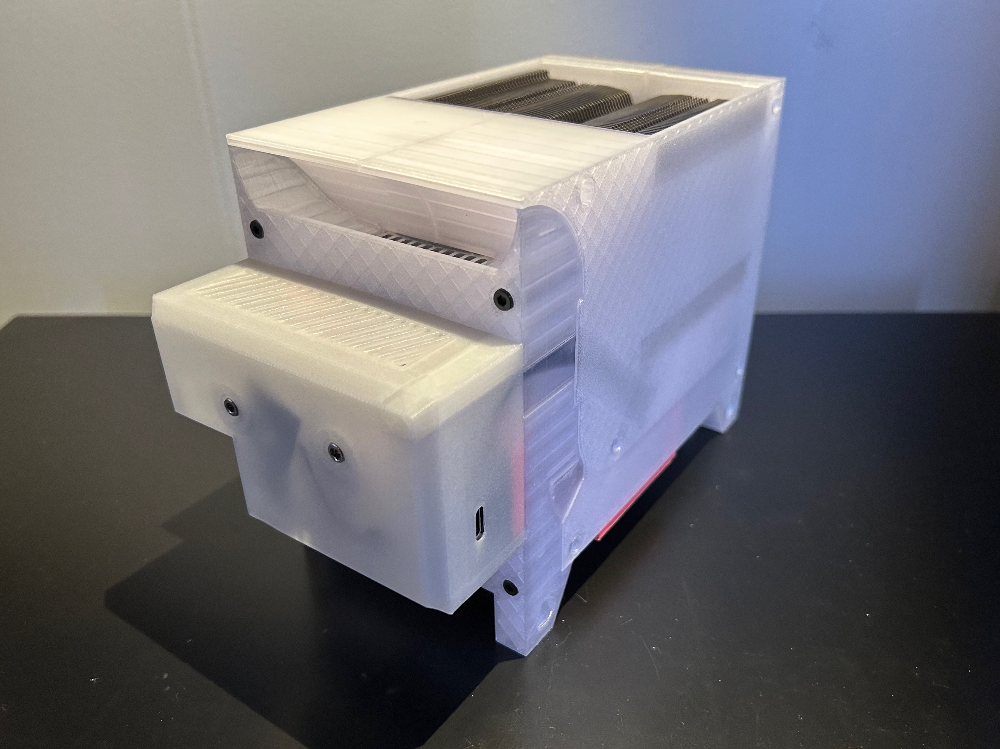

# FilaBilly Humidor

The FilaBilly Humidor (FBH) is a smart cabinet for 3D printer filament storage and humidity control.  It's based on an IKEA BILLY bookcase and contains an active dehumidifier.  It has lighting, environment sensors, and a display screen, and it is Internet enabled.

The FilaBilly Humidor is based on [ESPHome](https://esphome.io/).  It can be used as a standalone device or integrated into [Home Assistant](https://homeassistant.io/).

## FilaBilly Dehumidifier

The FilaBilly Dehumidifier (FBD) is the dehumidifier component.  It is a compact active dehumidifier that is also Internet enabled.  The FBD can also be used without the FBH, either standalone or directly integrated into Home Assistant.  The FBD also uses ESPHome.